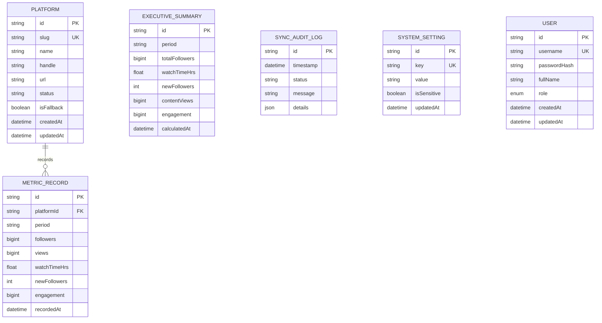

# EPA Punjab Social Media Dashboard — Clean Architecture & Engineering Guide

## 1. Executive Architecture Overview

This enterprise system is constructed adhering to **Clean Architecture** (Uncle Bob / Hexagonal Architecture / Ports & Adapters) and **Domain-Driven Design (DDD)** principles. The codebase strictly separates concerns across distinct boundaries:

```
+-------------------------------------------------------------------------+
|                           Presentation Layer                            |
|             (HTTP Controllers, Express REST Endpoints, RBAC)            |
+-------------------------------------------------------------------------+
                                    |
                                    v
+-------------------------------------------------------------------------+
|                            Application Layer                            |
|        (Use Cases: GetMetrics, SyncPlatforms, AuthUseCase, Config)      |
+-------------------------------------------------------------------------+
                                    |
                                    v
+-------------------------------------------------------------------------+
|                              Domain Layer                               |
|        (Core Entities: PlatformMetric, ExecutiveSummary, User, Ports)   |
+-------------------------------------------------------------------------+
                                    ^
                                    |
+-------------------------------------------------------------------------+
|                          Infrastructure Layer                           |
|        (PostgreSQL + Prisma ORM, AuthService, Social Fetchers, Scraper)  |
+-------------------------------------------------------------------------+
```

### Dependency Inversion Principle (DIP)
- **High-level modules (Domain & Application)** do NOT depend on low-level modules (Database, Frameworks, Network).
- Both depend upon abstractions (`IMetricsRepository`, `IConfigRepository`, `IUserRepository`, `ISocialFetcher`).
- The **Infrastructure layer** implements these abstractions via Prisma, native cryptographic algorithms, and external API connectors.

---

## 2. Directory Structure

```
Social Media Dashboard/
├── backend/                       # Dedicated Backend Service
│   ├── prisma/                    # PostgreSQL Schema & Migrations
│   │   ├── schema.prisma          # Prisma ORM schema (Platforms, Metrics, Users)
│   │   └── seed.ts                # Baseline data & user accounts seeder
│   ├── scripts/
│   │   └── scrape_live_metrics.py # Live public web scraper fallback
│   ├── src/
│   │   ├── domain/                # Enterprise Business Logic
│   │   │   ├── entities/          # PlatformMetric, ExecutiveSummary, SyncLog, User, AppConfig
│   │   │   └── repositories/      # IMetricsRepository, IConfigRepository, IUserRepository
│   │   ├── application/           # Application Use Cases
│   │   │   └── use-cases/         # GetMetricsUseCase, SyncPlatformsUseCase, AuthUseCase, ConfigUseCase
│   │   ├── infrastructure/        # Framework & Library Adapters
│   │   │   ├── database/          # PrismaClientSingleton, PrismaMetricsRepository, PrismaUserRepository
│   │   │   ├── auth/              # AuthService (PBKDF2 hashing, HMAC signed session tokens)
│   │   │   ├── fetchers/          # Facebook, YouTube, TikTok, Instagram, X, LinkedIn clients
│   │   │   └── config/            # ConfigService, KeyMaskingService
│   │   └── interfaces/http/       # HTTP Delivery Layer
│   │       ├── controllers/       # MetricsController, AuthController, SyncController, ConfigController
│   │       ├── routes/            # apiRouter (Express)
│   │       └── middlewares/       # authGuard (RBAC), requestLogger, errorHandler
│   ├── tests/                     # Automated Tests (Jest + Supertest)
│   │   ├── unit/                  # Domain entity, calculation & auth test suites
│   │   └── integration/           # HTTP API supertest integration suite
│   ├── package.json
│   └── tsconfig.json
│
├── frontend/                      # Decoupled Single Page Application (SPA)
│   ├── public/                    # Static distribution
│   │   ├── index.html             # Clean HTML entry shell (No developer badges)
│   │   └── assets/                # EPA Punjab official emblems & icons
│   └── src/                       # Modular Source Code
│       ├── js/
│       │   ├── api/               # apiClient (Network communication with Bearer token auth)
│       │   ├── state/             # dashboardState (Reactive centralized store)
│       │   ├── router/            # viewRouter (SPA hash router: #dashboard, #platform/:id, #settings)
│       │   ├── components/        # Header, KpiCards, PlatformColumns, PlatformDetailView, AdminSettingsView
│       │   ├── utils/             # Formatters, Math helpers
│       │   └── main.js            # Bootstrapper
│       └── css/                   # Structured stylesheets
│
├── docker/                        # Containerization
│   └── docker-compose.yml         # PostgreSQL 16 + Backend container orchestration
├── docs/                          # Architecture & Operations Manuals
│   └── ARCHITECTURE.md
├── tests/                         # End-to-End Suite
│   └── e2e/                       # Playwright browser verification (run_e2e.py)
├── .env.example                   # Sanitized configuration template
└── README.md                      # Project manual
```

---

## 3. Database Schema & Persistence (Prisma + PostgreSQL)

The persistence model is defined in `backend/prisma/schema.prisma` targeting PostgreSQL:



### Resilient Repository Architecture
The `PrismaMetricsRepository` and `PrismaUserRepository` dynamically test database availability using `PrismaClientSingleton.checkConnection()`. If PostgreSQL is available, it persists and queries records with full ACID guarantees. If PostgreSQL is offline or credentials are being configured, it gracefully falls back to an in-memory operational baseline store with detailed telemetry logs, guaranteeing 100% uptime.

---

## 4. API Endpoints Reference

| Method | Endpoint | Description | Layer | Security |
|---|---|---|---|---|
| `GET` | `/api/status` | Health check & PostgreSQL connection status | Presentation | Public |
| `POST` | `/api/auth/login` | Authenticate user & issue signed session token | Application | Public |
| `GET` | `/api/auth/me` | Return active authenticated user profile | Application | Authenticated |
| `GET` | `/api/metrics` | Retrieves summary & 6 platform metrics (supports `from` & `to`) | Application | Public |
| `POST` | `/api/sync` | Executes live fetch from social platform APIs | Application | Public |
| `GET` | `/api/config` | Retrieves masked configuration settings | Application | **ADMIN only** |
| `POST` | `/api/config` | Updates credentials in persistence and `.env` | Application | **ADMIN only** |
| `POST` | `/api/test-connection` | Validates API credentials for a platform | Infrastructure | **ADMIN only** |

---

## 5. Automated Test Pyramid

1. **Unit Tests (`backend/tests/unit/`)**:
   - Verify `PlatformMetric` domain calculation rules and period scaling.
   - Verify `ExecutiveSummary` cross-platform aggregation.
   - Verify security credential masking in `AppConfig`.
   - Verify cryptographic password hashing and HMAC token issuance in `AuthService`.
   - Verify RBAC access role assignment and rejection of unauthorized logins in `AuthUseCase`.
2. **Integration Tests (`backend/tests/integration/`)**:
   - Verify all Express HTTP routes, HTTP status codes, and JSON response contracts using `supertest`.
   - Verify RBAC protection on `/api/config` (401 when unauthenticated, 403 when executive, 200 when admin).
   - Verify dynamic date calculations on `/api/metrics?from=...&to=...`.
3. **End-to-End Tests (`tests/e2e/`)**:
   - Verify clean government UI (zero developer watermarks, no PERA toggles).
   - Verify dynamic date range picker with automatic day calculations.
   - Verify master-detail navigation for Facebook and LinkedIn.
   - Verify Administrator Security Gate and unlocked API credentials hub.
